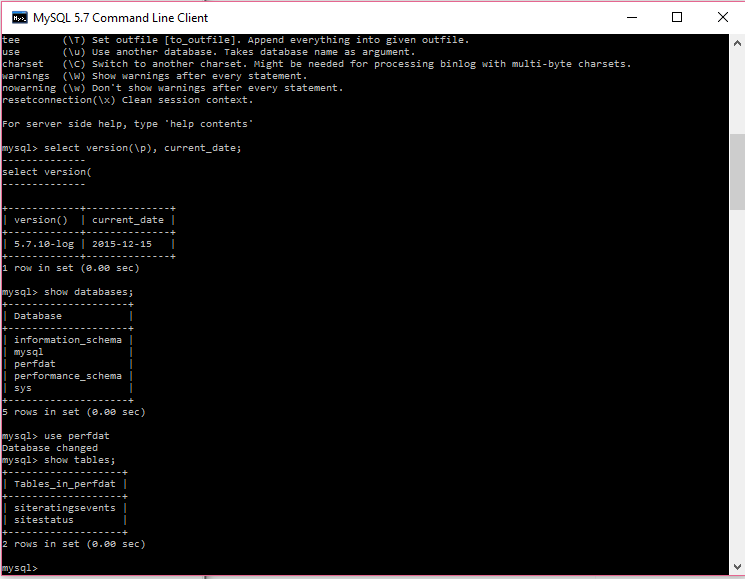

## Introduction
While my background is primarily working with either Oracle or T-SQL databases, MySQL is also an important variant.  I've taken some simple questions from a quick technical case study I received as the point of departure for this small project in which I will create a MySQL database, tables, and queries.  

The steps in the process I went through to analyze my response to the small case study were:

1.  Identify and download an open source database for a Windows 10 machine
2.  Build and then start a database instance
3.  Build tables in the new database
4.  Add data to the new tables
5.  Write queries to answer the questions

### Download the database software

I downloaded MySQL for Windows from the following site:
[http://dev.mysql.com/downloads/windows/installer/5.7.html](http://dev.mysql.com/downloads/windows/installer/5.7.html)

and executed the mysql-installer-web-community-5.7.10.0.msi which opened up the MySQL Workbench.  I poked around a bit and figured out the gui as well as the CLI interface for MySQL 5.7.  I was then confident to begin building a database.  


### Create a database
I'll be loading most of my tables in a new database.  If / when I figure out what further work I might do, would drive the schema build, but for the purpose of this small project, I'm just building one and will be throwing a variety of tables in there to test various queries against it.

```MySQL
create database PerfDat;
```

### Build tables

I was given two tables to work with in the assignment.


**SiteRatingsEvents**

Site ID   |     Quality Rating	|Rating Type	                |Date Rating Received
----------|---------------------|-------------------------------|--------------------
27376	  |      2	        |Initial Rating	                |3/12/2014
27376	  |      3	        |Deficiency Area Re-Rating	|11/12/2014
54415     |	 2	        |Initial Rating	                |6/27/2014


*and*


**SiteStatus**

Site ID        |Active
---------------|-------
27376	       | Yes
54415	       | No


```MySQL
create table SiteRatingsEvents (
Site_ID int,
Quality_Rating int,
Rating_Type varchar(150),
Date_Rating_Received datetime
)


create table SiteStatus (
Site_ID int,
Active varchar(3)
)
```



### Load the example data into the tables
For another data set and another block of analytics I'll be playing with, I found that the MySQL load wizard was much too slow for the 351,981 rows of information with its 21 columns.  So, I used the following command and loaded that into a SysDat table (not shown in the create table above) and the load was very quick.  The caveats are that the file was .txt because I did have a char field which had commas in it.  I moved my file to the temp directory instead of trying to play with loose references.  
```MySQL
LOAD DATA INFILE '/Temp/sysdat.txt' INTO TABLE SystemData;
```
For the two tiny tables above, I just used the syntax available to load 

```sql

INSERT INTO `perfdat`.`siteratingsevents` 
(`Site_ID`,
`Quality_Rating`,
`Rating_Type`,
`Date_Rating_Received`)
VALUES
(27376,
2,
'Initial Rating',
'2014-3-12'),
(27376,
33,
'Deficiency Area Re-Rating',
'2014-11-12'),
(54415,
2,
'Initial Rating',
'2014-6-27')
```
One of the interesting syntax points which caught me was the use of the (`) character instead of the single quote (').  I had to use the forward single quote to get the fields properly identified and separated for a char datatype.

```sql
INSERT INTO perfdat.sitestatus
(`Site_id`, `Active`) 
VALUES
(27376,'Yes'),
(54415,'No')
```

###Question #1
>To begin with the client would like to know the number of sites that have completed a rating event? Please show us what SQL query you would write to return this information.
```sql
select 
        count(distinct site_id) as site_completed
from siteratingsevents
where Quality_Rating is not null
```
or
```sql
select 
        count(distinct site_id) as rating_recd_ct
from siteratingsevents
where date_rating_received is not null
```
|site_completed|
|--------------|
|2             |

There are a variety of ways to query this, I'm just not sure where a null will show up or what a non-response would look like.

###Question #2
>The client now informs you that some of the sites that had been rated have now dropped out of the program. They provide you with the following table (SiteStatus). They would like to know how many active sites have completed the rating process? 

[MySQL does not support the WITH statement](http://stackoverflow.com/questions/324935/mysql-with-clause) - what I returned in my response, so I'll need to rework the query.
```mysql
select count(distinct a.site_id) as completed_site from 
(select distinct site_id as site_id from siteratingsevents where date_rating_received is not null) as a
right join 
(select site_id from sitestatus where active = 'YES') as b
on a.site_id = b.site_id
group by a.site_id
```
|completed_site| 
|--------------| 
|1             | 

###Question #3
Now the client would like to know how many sites are at each rating level?
```mysql
select 
        quality_rating as rating_level, 
	count(distinct site_id) as site_ct 
from siteratingsevents
group by quality_rating

```
rating_level    |site_ct|
----------------|-------|
2               | 2     |
33              | 1     |


[Return to the Portfolio Main Page](https://github.com/andrea345/Portfolio/blob/master/README.md)

